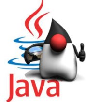

# Java 01: Java Fundamentals

На основе [Epam Java Core](https://training.by/Registration/Registration/1699)

### Список материалов:
- Basics
    - [0. History of Java language and platform](./doc/00_history.md)
    - [1. Java Basics](./doc/01_basics.md)
    - [1.1 Jit Compiler](./doc/jit.md)
    - [2. Working with Java data types](./doc/02_datatypes.md)
    - [2.1 Objects and classes](./doc/objects.md)
    - [2.2 Data Areas](./doc/dataareas.md)
    - [3. Using operators and decision constructs](./doc/03_operatorsAndDecisions.md)
    - [4. Creating and Using Arrays](./doc/04_arrays.md)
    - [5. Using Loop Constructs](./doc/05_loops.md)
    - [6. Working with Methods and Encapsulation](./doc/06_encapsulation.md)
    - [7. Working with Inheritance](./doc/07_inheritance.md)
    - [8. Handling Exceptions](./doc/08_exceptions.md)
    - [9. Working with selected classes from the Java API](./doc/09_workWithSelectedClasses.md)
    - [Recursion](./doc/recursion.md)

- OOP
    - Java class design
    - Encapsulation
    - Inheritance
    - Polymorphism
    - Advanced Java class design

- More concepts
    - Handling exceptions
    - Enums
    - Generics and collections
    - Annotations
    - Reflection
    - Regular expressions fundamentals

- Java concurrency
    - Thread concepts
    - Common problems (race condition, visibility, liveness)
    - Language support (synchronized, volatile)
    - Basic library support (wait/notify)
    - Advanced library support overview (java.util.concurrent.*)

- Java 8
    - Lambda built-in functional interfaces
    - Optional
    - Java Stream API
    - Use Java SE 8 Date/Time API

- Data handling library classes
    - Java I/O fundamentals
    - Serialization
    - Java file I/O (NIO.2)
    - Networking
    - Building database applications with JDBC
    - XML/JSON review
    - Basic concepts of logging