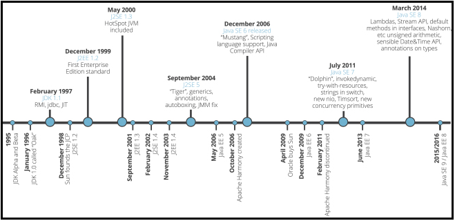

#  History of Java language and platform

## Содержание:
- [Рождение языка](#Born)
- [Изменения в языке](#VersionChanges)

## [↑](#Home)  Рождение языка
Первая версия, то есть первый релиз, состоялся в 1996 году.
История возникновения языка Java хорошо описана в лекции на intuit:
[Лекция 1: Что такое Java? История создания](http://www.intuit.ru/studies/courses/16/16/lecture/27105?page=1)
И в видео:
[Java SE. Урок 1. История создания языка программирования Java](https://www.youtube.com/watch?v=l8Fn_aM_Np4)

## [↑](#Home)  Изменения в языке
Изменения в Java по версиям можно проследить по статье "[Java version history](https://en.wikipedia.org/wiki/Java_version_history#J2SE_1.2)".
Краткое содержание на графике:

После появления Java на свет в 1996 году следующая версия 1.1 вышла через год.
В **JDK 1.1** появилась:
- Переработка AWT (Abstract Window Toolkit)
- Появились Java Beans
- Поддержка работы с базами данных (JDBC)
- RMI (программный интерфейс вызова удаленных методов)
- Поддержка Unicode и интернационализации
- JIT на Windows платформах
- Частичная поддержка Reflection

Далее выходит **J2SE 1.2**:
- strictfp keyword ([Модификатор strictfp](https://ru.stackoverflow.com/questions/617822/%D0%9C%D0%BE%D0%B4%D0%B8%D1%84%D0%B8%D0%BA%D0%B0%D1%82%D0%BE%D1%80-strictfp))
- Графический API Swing
- Java плагины
- Collection Framework
- Java IDL (см. [Getting Started with Java IDL](https://docs.oracle.com/javase/8/docs/technotes/guides/idl/GShome.html))

Позже выходит **J2SE 1.3** в 2000 году:
- В поставку включается HotSpot JVM
- Доработки RMI
- JavaSound
- JNDI "из корбки" - Java Naming and Directory Interface (JNDI)
- Java Platform Debugger Architecture (JPDA)
- Synthetic proxy classes ([Synthetic Class in Java](https://stackoverflow.com/questions/399546/synthetic-class-in-java))

Далее на свет появляется **J2SE 1.4**:
- Добавилось ключевой слово assert (см. "[Что делает ключевое слово Java assert](http://qaru.site/questions/16319/what-does-the-java-assert-keyword-do-and-when-should-it-be-used)")
- Поддержка регулярных выражений
- Объединение исключений в цепочки (Exception chaining)
- Поддержка Internet Protocol version 6 (IPv6)
- Non-blocking IO (named New Input/Output, NIO) (JSR 51)
- Logging API (JSR 47)
- Image I/O API для чтения и записи в форматах JPEG и PNG
- Встроенный XML парсер и XSLT процессов (JAXP) (JSR 5 и JSR 63)
- Встроенные security and cryptography extensions (JCE, JSSE, JAAS)
- Java Web Start included (JSR 56)
- Preferences API ([java.util.prefs](https://docs.oracle.com/javase/8/docs/technotes/guides/preferences/index.html))

Позже вышла версия **J2SE 5**:
- Обобщения или Generics (JSR 14)
- Аннотации (metadata, JSR 175)
- Autoboxing/unboxing (JSR 201 - конвертация между примитивными типами и объектными)
- Ключевое слово enum (JSR 201)
- Varargs - последний параметр метода может иметь тип с тремя точками. "Синтаксический сахар", позволяющий помещать объекты в массив
- For each loop (JSR 201)
- Улучшения параллельного выполнения программ
- Статические импорты
- Добавлен класс Scanner
- Утилиты для многопоточности в пакете java.util.concurrent
- Доработки Swing

Далее вышла версия **J2SE 6**:
- Scripting Language Support (JSR 223)
- JDBC 4.0 support (JSR 221)
- Java Compiler API (JSR 199): API позволяющее Java программам вызывать Java Compiler программно
- JAXB обновлён до 2.0 с добавлением поддержки StAX (JSR 269)
- Pluggable annotations (JSR 269)
- GUI improvements
- Доработки JVM (сборка мусора, улучшение производительности и т.п.)

Далее вышла версия **J2SE 7**:
- Поддержка динамических языков програм (invokedynamic bytecode, JSR-292)
- Strings в конструкциях switch
- Автоматическое управление ресурсами в try-statement
- diamond operator <>
- Binary integer literals
- В числовых литералах разрешено нижнее подчёркивание
- Множественные catch
- Concurrency utilities (JSR 166)
- New file I/O library (defined by JSR 203)
- java.nio.file.attribute and java.nio.file.spi
- Timsort is used to sort collections and arrays of objects instead of merge sort

С выходом версия **J2SE 8**:
- Поддержка лямбда выражений
- Project Nashorn, JavaScript runtime, позволяющий разработчикам встраивать JavaScript в приложения (JSR 223, JEP 174)
- Annotation on Java Types (JSR 308, JEP 104) см. [type annotations](https://docs.oracle.com/javase/tutorial/java/annotations/type_annotations.html)
- Repeating annotations (JSR 337, JEP 120)
- Date and Time API (JSR 310, JEP 150)
- Statically-linked JNI libraries (JEP 178)
- Launch JavaFX applications (JEP 153)
- Убран permanent generation (JEP 122)

С выходом версия **J2SE 9**:
- Project Jigsaw (Java Platform Module System)[154]
- jshell: The Java Shell (a Java REPL) JEP 222
- Ahead-of-Time Compilation (JEP 295)
- XML Catalogs (JEP 268)
- Concurrency Updates (JEP 266): implementation of Reactive Streams
- jlink: The Java Linker (JEP 282)
- Variable Handles: Define a standard means to invoke the equivalents of various java.util.concurrent.atomic and sun.misc.Unsafe operations (JEP 193)

Ожидается в **J2SE 10**:
- Money and Currency API (JSR 354)

