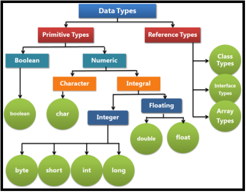

# <a name="Home"></a> Working with Java data types

## Содержание:
- [Обзор](#Overview)
- [Целочисленные типы](#Integer)
- [Числа с плавающей точкой](#Floating)
- [Другие типы](#OtherTypes)
- [Boxing & Unboxing](#Boxing)
- [Формат литералов](#Literal)
- [Приведение типов](#Casting)
- [Дополнительные материалы](#Resources)

## [↑](#Home) <a name="Overview"></a> Обзор
Данный раздел относится к [OCA Java SE 7: Data Types](https://quizlet.com/29541697/oca-java-se-7-data-types-flash-cards) из [Programmer Level I Exam](http://www-inf.it-sudparis.eu/cours/java/javatutorial/extra/certification/javase-7-programmer1.html).

В Java используемые типы данных можно разделить на две категории:
- Примитивные
- Ссылочные (объектные)

Существует **8** примитивных типов, как количество битов в байте.
4 из них являются целочисленными (**Integer**), два из них являются числами с плавающей точкой (**Floating**), логический **boolean** и символьный **char**.

Минимальной единицей информации является **бит**. Он может принимать значение **1** или **0**. По сути, вся информация из себя и представляет набор единиц и нулей, то есть бит. Так как мы работаем с двоичной системой, то значение вычисляется при помощи возведения **2** в определённую степень.

Для вычисления можно следовать следующей логике: 2 в степени 2 (т.е. в квадрате) = 4. Дальше каждая степень является результатом умножения предыдущего числа на 2. Поэтому, получаем следующую цепочку:
``4`` -> ``8`` -> ``16`` -> ``32`` -> ``64`` -> ``128`` -> ``256`` -> ``512`` -> ...

Подробнее можно прочитать в статье "[Примитивные типы в Java](https://sohabr.net/habr/post/261315/)".

## [↑](#Home) <a name="Integer"></a> Целочисленные типы
### byte
8 бит объединяются в 1 байт и образуют самый маленький примитивный тип в Java, называемый **byte**.
Принимает значения от -128 до 127. Казалось бы, почему не до 128? А всё потому, что 1 бит "расходуется" на определение того, положительное число или нет.
Подробнее см. [Why is the range of bytes -128 to 127 in Java?](https://stackoverflow.com/a/42623517).
Значение можно запомнить как -2 в степени на единицу меньшей, чем количество бит для нижней границы, а для верхней границы тоже самое но минус 1 (т.к. -1 бит на знак).
++Минимальное значение++: -2^7. Как мы видели ранее, это -128.
++Максимальное значение++: 2^7 - 1 = 128-1 = 127

### short
Следующий тип - короче чем integer. Поэтому называется **short**.
Размер примитивных типов возрастает в 2 раза. Его размер больше чем байт в 2 раза, т.е. 8*2=16, но меньше чем integer в 2 раза.
++Минимальное значение++: -2^15
++Максимальное значение++: 2^15-1

### integer
Следующий примитивный тип - **integer**. Он в 2 раза больше, чем short и равен 32 битам.
++Минимальное значение++: -2^31
++Максимальное значение++: 2^31-1
Это почти 2 с девятью нулями, даже больше.
В интернете можно найти сведения, например в статье "[Примитивные типы в Java](https://sohabr.net/habr/post/261315/)", что при выполнении действий с short и byte они будут приведены к integer (так называемое **расширяющее преобразование**).

### long
Следующий тип - длиннее чем integer. Поэтому называется **long**.
Он больше чем integer в 2 раза и равен 64 битам.
Соответственно, его значения от -2^63 до 2^63-1.

## [↑](#Home) <a name="Floating"></a> Числа с плавающей точкой (действительные)
Реализованы в Java в виде двух примитивных типов:
- **float** (32 бита)
- **double** (64 бита)
Примером может служить число pi из матерматики:
```java
public class FloatAndDouble {
 	public static void main(String[] args) {
        float piValue = (float)Math.PI;
        double piValueExt = Math.PI;
        System.out.println("Float value: "+piValue );
        System.out.println("Double value: "+piValueExt );
    }
}
```
Можно увидеть разницу, скопировав код сюда: [compile java online](https://www.tutorialspoint.com/compile_java_online.php).
Результат:
```
Float value: 3.1415927
Double value: 3.141592653589793
```
Лишний раз вспомним, что Math - часть пакета java.lang, подключаемый по умолчанию.
Так же стоит не забывать и про разницу в точности. Подробнее см. "[Потеря точности из Double во Float или «Куда пропадали копейки?»](https://habrahabr.ru/post/201066/)
Здесь же можно упоминуть и про модификатор strictfp. Подробнее см. "[Модификатор strictfp](https://ru.stackoverflow.com/questions/617822/%D0%9C%D0%BE%D0%B4%D0%B8%D1%84%D0%B8%D0%BA%D0%B0%D1%82%D0%BE%D1%80-strictfp)".

##  [↑](#Home) <a name="OtherTypes"></a> Другие типы
### char
Представляет из себя Unicode символ и занимает 16 бит (половину от того, что занимает integer).
Его значение по умолчанию равно ‘\u0000’.
Как сказано в [Java Api: Character](https://docs.oracle.com/javase/8/docs/api/java/lang/Character.html), "A char value, therefore, represents Basic Multilingual Plane (BMP) code points" - т.е. это ["Основная многоязычная плоскость"](https://goo.gl/9WVdQ4).

### boolean
Хранят логическое значение true или false.
Несмотря на то, что казалось бы, может иметь значение 0 или 1 занимаемый объём памяти зависит от конкретной реализации JVM.
Подробнее см. [Why is Java's boolean primitive size not defined?](https://stackoverflow.com/questions/1907318/why-is-javas-boolean-primitive-size-not-defined).

## [↑](#Home) <a name="Boxing"></a> Боксинг (упаковка) и анбоксинг (распаковка)
Начиная с JDK 5 введены понятия автобоксинг и анбоксинг.
Автобоксинг - это упаковка примитивного типа в его объектную обёртку.
Например: ``Integer i = 12;``

И тут стоит не забывать про интересную особенность. Есть некий **Constant pool**, в котором кэшируются значения Integer. Диапазон кэшируемых значений равен значению минимального примитива, т.е. byte: -128 до 127. Так как это относится к автобоксингу, то верхняя граница кэшируемых значений может быть настроена при помощи указания параметра JVM: "**-XX:AutoBoxCacheMax**".

```java
public class IntCache {
 	public static void main(String[] args) {
       Integer first = 127;
       Integer second = 127;
       System.out.println(first==second); //True
       first = new Integer(127);
       second = new Integer(127);
       System.out.println(first==second); //False
       first = Integer.valueOf(127);
       second = Integer.valueOf(127);
       System.out.println(first==second); //True
    }
}
```
При использовании параметризированного конструктора будет результат false потому, что мы явно просим создать для нас новый объект. В других вариантах в любом случае будет вызван **valueOf**, который кэширует используемые integer при помощи **java.lang.Integer.IntegerCache**.

Более подробно в статье: "[Autoboxing и unboxing в Java](http://habrahabr.net/habr/329498/)"

## [↑](#Home) <a name="Literal"></a> Формат литералов
Литерал - явно заданное значение. Могут быть указаны следующим образом:
- Десятеричная система: ``10;``
- Шестнадцатеричная система: ``0x1F4``, начинается с ``0x``
```
--> Перевод числа в шестнадцатеричную систему:
500/16: 31 при умножении на 16 даёт 496, 500-496, даёт остаток 4
31/16: можем 16 только умножить на 1, 31-16 даёт остаток 15
Дошли до 1, дальше не продолжаем. 15 это F.
На конце 1. Переворачиваем 4F1 и получаем ответ: 1F4
--> Обратное действует так же:
1F4 состоит из трёх чисел, поэтому:
1*16^2 + 15*16^1 + 4*16^0 = 256 + 240 + 4 = 496 + 4 = 500
```
- Восьмеричная система: ``010``, начинается с нуля.
```
По аналогии с вышеуказанной:
010 = 3 знака
0*8^2 + 1*8^1 + 0*8^0 = 0+8+0 = 8
```
- Двоичная система (начиная с Java7): ``0b101`` ,[начинается с 0b](http://docs.oracle.com/javase/7/docs/technotes/guides/language/binary-literals.html)
```
1*2^2 + 0*2^1 + 1^2^0 = 1*4 + 1 = 5
```
Пример переводов можно также посмотреть в книгах, вроде этой: [Assembler: Учеб. для вузов](https://goo.gl/VNs9xr).

## [↑](#Home) <a name="Casting"></a> Приведение типов
Приведение типов описано в главе "[Chapter 5. Conversions and Contexts](https://docs.oracle.com/javase/specs/jls/se8/html/jls-5.html)" спецификации языка Java.
Приведение типов бывает:
- сужающим (Narrowing conversions)
- расширяющим (Widening conversions)

Про преобразование типов хорошо описано тут:
- "[Преобразования базовых типов данных](https://metanit.com/java/tutorial/2.2.php)"
- "[Преобразование типов в Java](https://vertex-academy.com/tutorials/ru/prividenie-tipov-v-java/)"
- "[Преобразование примитивных типов в Java](http://pr0java.blogspot.ru/2015/12/java.html)"

Интересная особенность при вычислениях: [Сложение 2 чисел типа short в Java](https://ru.stackoverflow.com/questions/608863/%D0%A1%D0%BB%D0%BE%D0%B6%D0%B5%D0%BD%D0%B8%D0%B5-2-%D1%87%D0%B8%D1%81%D0%B5%D0%BB-%D1%82%D0%B8%D0%BF%D0%B0-short-%D0%B2-java).

## [↑](#Home) <a name="Resources"></a> Дополнительные материалы
- [Beginning Java: Data types, Variables, and Arrays](https://www.sitepoint.com/beginning-java-data-types-variables-and-arrays/)
- [Primitive Data Types](https://docs.oracle.com/javase/tutorial/java/nutsandbolts/datatypes.html)
- [The Numbers Classes](https://docs.oracle.com/javase/tutorial/java/data/numberclasses.html)