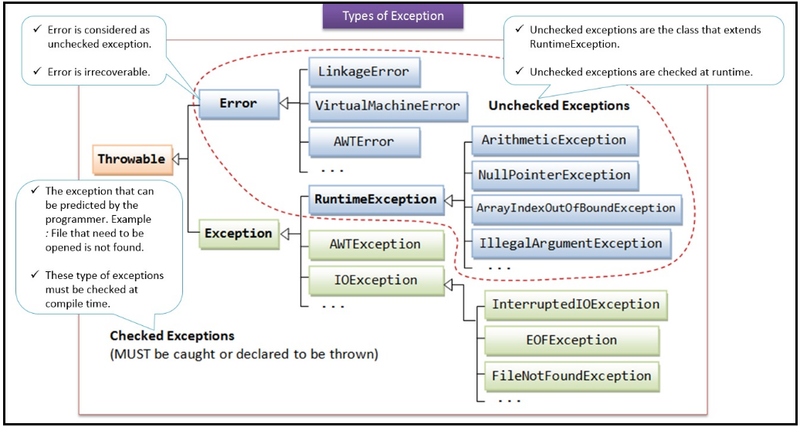

# <a name="Home"></a> Handling Exceptions

## Содержание:
- [Overview](#Overview)
- [Checked exceptions, RuntimeException, and Error](#CheckedUnchecked)
    - [Error](#Error)
    - [Exception](#Exception)
    - [Other](#Other)
    - [Checked \ Unchecked](#CheckedOrNot)
    - [Error Check](#ErrorCatch)
- [Create a try-catch block](#TryCatch)
- [The advantages of exception handling](#Advantages)
- [Create and invoke a method that throws an exception](#Throws)
- [Recognize common exception classes and categories](#Recognize)
- [Ресурсы](#Resources)

## [↑](#Home) <a name="Overview"></a> Overview
Данный раздел относится к [OCA Java SE 8 Programmer I](http://education.oracle.com/pls/web_prod-plq-dad/db_pages.getpage?page_id=5001&get_params=p_exam_id:1Z0-808).
Разделы: "[Java SE 8 Programmer I Exam Topics](https://docs.oracle.com/javase/tutorial/extra/certification/javase-8-programmer1.html#exceptions)"
Подробнее: "[8. Handling Exceptions](http://javacertification.wikidot.com/exceptions)"

## [↑](#Home) <a name="CheckedUnchecked"></a> Checked exceptions, RuntimeException, and Error
Типы Exceptions описаны в официальном tutorial: [The Catch or Specify Requirement](https://docs.oracle.com/javase/tutorial/essential/exceptions/catchOrDeclare.html).


Различные ошибки бросаются в нас при выполнении программы.
Бросать по английски - throw. Суффикс "abble" - способный, пригодный для чего-либо.
Всё, что пригодно для того, чтобы быть брошенным в нас, чтобы проинформировать о чём-то нештатном, **наследуется** от **Throwable**.
Это полноценный класс, предоставляющий различные методы для работы со StackTrace, сообщением об ошибке.

У **Throwable** есть два основных потомка: **Error** и **Exception**

## [↑](#Home) <a name="Error"></a> Error
**Error** - представляет из себя серьёзные системные ошибки, произошедшие во время выполнения программы.
Например:
- **VirtualMachineError** - Виртуальная машина Java вышла за пределы ресурсов или произошло что-то, что "сломало" работоспособное состояние.
- **LinkageError** - Такая ошибка может возникать в тех случаях, когда один и тот же класс был загружен разными загрузчиками, что привело к конфликту.
- **AWTError** - AWT - платформенно-независимое API для построение графических интерфейсов. Могут возникать ошибки, когда не хватает каких-либо библиотек, например: "java.awt.AWTError: Assistive Technology not found".
Как видно из примеров, данные ошибки являются внутренними, системными, завязанными на библиотеки (их отсутствие, наличие конфликтов между ними и т.д.), на состояние системных ресурсов.
**StackOverflowError** - переполнение стэка вызовов. Например, при бесконечной рекурсии.

## [↑](#Home) <a name="Exception"></a> Exception
**Exception** - исключительные ситуации, произошедшие во время выполнения программы.
И условно все Exception можно разделить на **RuntimeException** и **остальные**.

**RuntimeException** - базовый класс для исключительных ситуаций, возникших при нормальной работе Java Virtual Machine. Как помним, **Error** - ошибки при **НЕ**нормальной работе Java Virtual Machine.
К таким нормальным ошибкам относятся такие исключительные ситуации, как:
- **NullPointerException** - выполняется работа с ссылочной переменной, которая никуда не ссылается. Если говорить просто, то мы ожидаем объект, а его там нет. Кто-то из разработчиков ошибся в коде и не обработал отсутствие данных.
- **ArrayIndexOutOfBoundException** - при работе с массивом кто-то из разработчиков ошибся в вычислении индекса и вышел за границы массива.
- **IllegalArgumentException** - при работе с кодом разработчик, его вызывающий, ошибся и передал некорректные аргументы.
- **Arithmetic** - где-то разработчик выполнил некорректное арифметическое действие, например: "divide by zero"

Как видно из примеров, это ошибки разработчика при написании кода.
Совершать ошибки - это плохо, но это нормальная рабочая ситуация, которая произошла во время выполнения кода. Поэтому такие ошибки вынесены в отдельную иерархию от **RuntimeException**.

## [↑](#Home) <a name="Other"></a> Остальные
**Остальные** - исключения, которые произошли в силу стечения каких-то обстоятельств.
Например, к таким остальным (т.е. не наследникам RuntimeException) относятся такие исключения:
- **IOException** - ошибка ввода вывода.
Например, мы попытались создать файл, но по стечению обстоятельств не можем это сделать. Например, нет прав, некорректный путь и т.п. (например, при File.createTempFile).
Например, **FileNotFoundException** и **SocketException**.
- **SQLException** (и работа с другими сторонними системами) - Произошла ошибка при работе с SQL.
- **CloneNotSupportedException** - выполняется попытка склонировать объект, клонирование которого не реализовано.
- **ParseException** - например, при попытке разобрать формат даты в java.text.DateFormat.

## [↑](#Home) <a name="CheckedOrNot"></a> checked \ unchecked
Throwable делятся на проверяемые (**checked**) и непроверяемые (**unchecked**).
Запомнить их просто.
Если это ошибка системная, т.е. Error - не проверяем.
Если это Runtime ошибка, т.е. где-то в коде мы ошиблись - не проверяем.
Runtime ошибки проверять было бы слишком избыточно. Пришлось бы на каждую строчку кода писать проверку, что прошлая строчка кода написана верно. Это уже слишком.
Такие throwable не проверяем (**unchecked**).

**Всё остальные checked.**
Например, если мы не смогли найти файл. Ведь мы написали код правильно, просто нет файла. И это не ошибка JVM. Просто нет файла. Нужно в коде как-то это обработать. Возможно, дать выбрать другой файл, попробовать поменять название, нормализировать путь и т.п. варианты.
По сути все checked исключения разработаны для того, чтобы один разработчик сказал другому: "У меня может случится нештатная ситуация. Но нам не должно быть всё равно, эту ситуацию мы должны обработать".

## [↑](#Home) <a name="ErrorCatch"></a> Проверка Error
На самом деле, даже Error можно перехватить.
```java
try {
	double[] megaArray = new double[Integer.MAX_VALUE];
} catch (java.lang.OutOfMemoryError e) {
	System.err.println(e.getMessage());
}
```

## [↑](#Home) <a name="TryCatch"></a> Create a try-catch block
Данная секциая описана в официальных tutorial'ах:
- [Catching and Handling Exceptions](#https://docs.oracle.com/javase/tutorial/essential/exceptions/handling.html)
- [The try Block](#https://docs.oracle.com/javase/tutorial/essential/exceptions/try.html)
- [The catch Blocks](#https://docs.oracle.com/javase/tutorial/essential/exceptions/catch.html)

Если необходимо обработать исключение в нашем участке кода, тогда код, для которого указан throws обрамляется в **try** блок:
```java
try {
	Thread.currentThread().sleep(100);
} catch (InterruptedException e) {
	System.out.println("Interrupted");
}
```

Данная конструкция может быть дополнена блоком **finally**. Данный блок выполняется всегда, вне зависимости от того, было ли брошено исключение или нет.

Правило написание безопасного и предсказуемого кода: Не писать return в catch.
Пример:
```java
private static int test(){
	int size=1;
	try {
		throw new Exception();
	} catch (Exception e) {
		return size; // Вернём значение отсюда
	} finally {
		size++; // Это изменение будет потеряно
		System.out.println("New Size: "+size);
	}
}
```
Как видно из примера, из catch мы возвращаем size. Хотя мы его увеличили с 1 до 2 в блоке finally, мы всё равно вернём значение, которое запомнили в catch.

## [↑](#Home) <a name="Advantages"></a> The advantages of exception handling
Преимущества обработки исключений описано в официальном tutorial:
- [What Is an Exception?](https://docs.oracle.com/javase/tutorial/essential/exceptions/definition.html)
- [Advantages of Exceptions](https://docs.oracle.com/javase/tutorial/essential/exceptions/advantages.html)

## [↑](#Home) <a name="Throws"></a> Create and invoke a method that throws an exception
Чтобы кинуть исключение необходимо так и написать:
```java
throw new IllegalStateException("Something went wrong!");
```
Даже дословно выйдет как кинуть новое исключение.

Если бросаемое исключение не будет являться Runtime исключением, то при объявлении метода понадобится указать throws:
```java
public static File createTempFile() throws IOException {
```

Если указать throws на непроверяемое исключение, то такое указание будет проигнорировано и обрабатывать непроверяемое исключение не заставят.
Данный раздел описывается в официальном tutorial: [Catching Exceptions](https://docs.oracle.com/javase/tutorial/essential/io/fileOps.html#exception)

## [↑](#Home) <a name="Recognize"></a> Recognize common exception classes and categories
Описание некоторых исключений: [Explanations of common Java exceptions](http://rymden.nu/exceptions.html)
Пример вопросов: [OCA Java SE 7 Programmer Study Guide (Exam 1Z0-803)](https://goo.gl/acwo97).

## [↑](#Home) <a name="Resources"></a> Ресурсы
Цикл статей на хабре: "[Исключения в Java, Часть I](https://habrahabr.ru/company/golovachcourses/blog/223821/)"
Вопросы и ответы: "[Собеседование по Java — исключения](http://javastudy.ru/interview/exceptions/)"
Quiz: "[Exception Handling](http://www.geeksforgeeks.org/java-gq/exception-handling-2-gq/)"
Упражнения: "[Exercise :: Exceptions](https://www.indiabix.com/java-programming/exceptions/)"